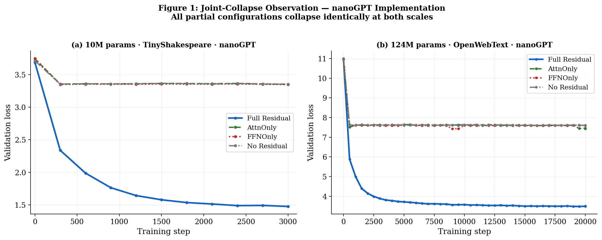
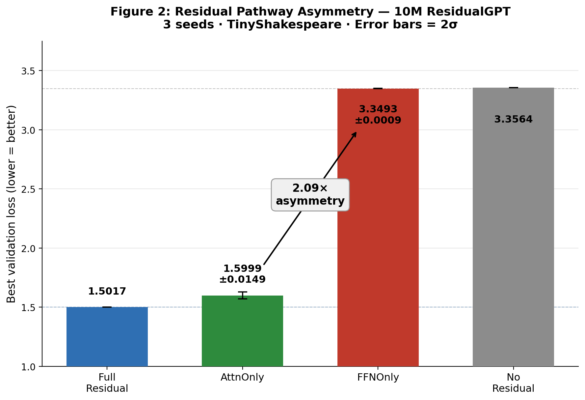
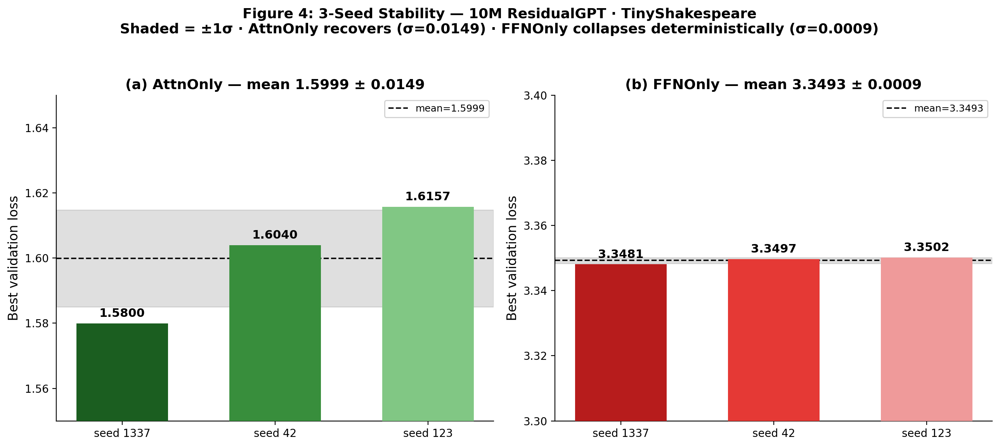
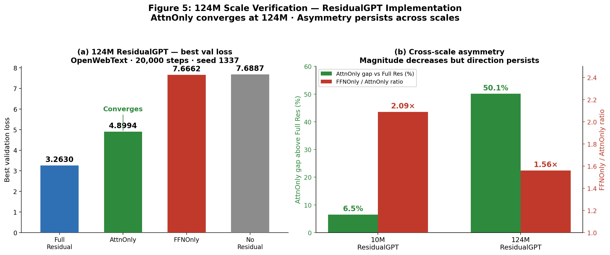
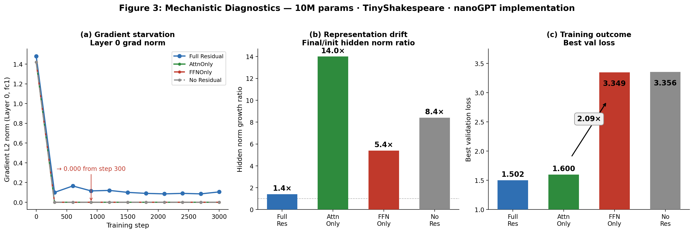

# A Reproducibility Study of Partial Residual Ablations

**A Robust FFN-Skip Collapse, an Unresolved Attention-Skip Recovery Effect, and a Confound Caught Along the Way**

**Pratik Patel** · Graduate Research Assistant, Arizona State University · Independent Research Project

---

## What this paper is about

The starting observation was simple: does a transformer still train if you remove only one of its two residual skip connections?

I first tested this in nanoGPT at 10M and 124M parameters. Both FFNOnly (attention skip removed) and AttnOnly (FFN skip removed) collapsed to the same floor as No Residual. That seemed like a clean result — both residual paths appear equally necessary.

Then I rebuilt the experiment with fixed validation batches (ResidualGPT), which removes evaluation noise for slowly-learning models. The result changed. FFNOnly still collapsed. But AttnOnly no longer did — it converged to 1.600 ± 0.015 at 10M, clearly distinct from the No Residual floor of 3.356.

That asymmetry became the paper's central observation. When I tried to reproduce it on new hardware, the FFNOnly collapse reproduced perfectly. The AttnOnly recovery did not — three deterministic reproduction seeds gave 2.591 ± 0.544, with one seed reaching the collapse floor itself.

**What is confirmed:** FFNOnly collapse is robust. Reproduces to four decimal places across every seed, every machine, and every CUDA determinism setting tested.

**What is not confirmed:** AttnOnly recovery. Originally recorded as 1.600 ± 0.015 at 10M and 4.899 at 124M (seed 1337). Subsequent reproduction under forced determinism gave 2.591 ± 0.544 at 10M. Two additional 124M seeds (7.586, 5.967) approached the collapse floor. The original software environment was not preserved, so the gap is unresolved.

---

## Why nanoGPT and ResidualGPT gave different results

nanoGPT samples fresh random validation batches at every checkpoint. For AttnOnly — which takes 200+ steps to break away from its initial plateau — this evaluation noise buries the slow improvement signal entirely. A model that improved from 3.35 to 3.30 between step 500 and 1000 will often look flat or regressing because the batch at step 1000 happened to be harder.

ResidualGPT fixes 50 validation batches at startup (seed 99991) and reuses them at every checkpoint across all four configs. AttnOnly's real learning signal becomes visible because variance is eliminated.

FFNOnly and NoResidual are unaffected by this difference — they sit at the floor regardless. Noise cannot bury improvement that does not exist.

---

## Key numbers

### nanoGPT — preliminary experiments

| Config | 10M val loss | 124M val loss |
|---|---|---|
| FullResidual | 1.475 | 3.493 |
| AttnOnly | 3.353 | 7.433 |
| FFNOnly | 3.348 | 7.430 |
| NoResidual | 3.352 | 7.430 |

All three ablated configs collapse to the same floor. This motivated rebuilding with fixed validation batches.



---

### ResidualGPT — primary experiments

#### 10M originally recorded

| Config | Best val loss | Seeds | Std |
|---|---|---|---|
| FullResidual | 1.502 | 1337 | — |
| AttnOnly | 1.600 | 1337/42/123 | ±0.015 |
| FFNOnly | 3.349 | 1337/42/123 | ±0.001 |
| NoResidual | 3.356 | 1337 | — |



#### 10M reproduction (forced determinism, new hardware)

| Config | Best val loss | Seeds | Std |
|---|---|---|---|
| FullResidual | 1.486 | 1337 | — |
| AttnOnly | 2.591 | 1337/42/123 | ±0.544 |
| FFNOnly | 3.350 | 1337/42/123 | ±0.000 |
| NoResidual | 3.356 | 1337 | — |

FFNOnly reproduces within 0.001. AttnOnly does not — seed 42 (3.354) reached the FFNOnly floor itself.



#### 124M — all AttnOnly seeds

| Config | Seed 1337 | Seed 42 | Seed 123 |
|---|---|---|---|
| AttnOnly | 4.899 | 7.586 | 5.967 |
| FFNOnly | 7.666 | — | — |
| NoResidual | 7.689 | — | — |

Seed 1337 (originally recorded) sits clearly below the floor. Seeds 42 and 123, run subsequently, approach it.



---

## Mechanistic diagnostics

Both AttnOnly and FFNOnly show identical gradient starvation at Layer 0 — grad norm collapses to 0.000 from step 300 onward in all partial-residual configs. Full Residual sustains ≈0.114 throughout.

Hidden-state norm growth diverges despite identical gradient starvation: AttnOnly 14.0×, FFNOnly 5.4×, FullResidual 1.4×. This was the first signal that the two configs were failing for structurally different reasons.

The proposed explanation — attention's cross-position routing provides a learnable substitute for the missing identity path, while the FFN's pointwise operations cannot — remains a working hypothesis. A direct falsification test (LocalMixer replacing attention) was inconclusive because the AttnOnly baseline did not reproduce on the test hardware.



---

## The confound (Section 5.1)

An earlier version applied output gain as a runtime multiplier:

```python
# Wrong — absorbed by AdamW within ~200 steps
out = sublayer(x) * gain
```

AdamW's per-parameter adaptive rates neutralize the scalar, making g=0.5, g=1.0, and g=2.0 produce near-identical training curves. The corrected version applies gain once at initialization:

```python
# Correct
block.attn.out.weight.data *= attention_gain
```

All numbers in this repo use the corrected implementation.

---

## Relation to He & Hofmann (2024)

He & Hofmann ("Simplifying Transformer Blocks," ICLR 2024) study skipless transformers from the opposite direction — whether architectural modifications can rescue removed skip connections.

- Their attention-skip removal = this paper's FFNOnly. They find rank collapse without modification, consistent with FFNOnly's robust collapse here.
- Their MLP-skip removal = this paper's AttnOnly. They find significant training speed loss without catastrophic collapse, consistent with the originally recorded AttnOnly partial recovery.

Key distinction: they test whether modifications can fix skipless training. This paper tests what happens with no modifications, across hardware and seed variation.

---

## Reproducibility

**FFNOnly** — reproduces exactly. Run the 10M notebook, expect 3.349 ± 0.001 across seeds on any hardware.

**AttnOnly** — environment-sensitive. The notebooks include forced determinism:

```python
os.environ['CUBLAS_WORKSPACE_CONFIG'] = ':4096:8'
torch.use_deterministic_algorithms(True)
```

Without these flags, AttnOnly gives different results every run from the same seed — confirmed experimentally: three trials with seed 1337 gave 1.9703, 1.9386, 2.0632. With the flags, results are consistent within an environment but will likely give ~2.2–2.6 rather than the originally recorded 1.600. The gap is documented in Section 8.3 of the paper.

---

## Repository structure

```
WHY-PARTIAL-RESIDUALS-FAIL/
├── Figures/
│   ├── figure1_joint_collapse.png
│   ├── figure2_10M_asymmetry.png
│   ├── figure3_mechanistic_diagnostics.png
│   ├── figure4_3seed_stability.png
│   └── figure5_124M_scale_verification.png
├── Notebooks/
│   ├── 10M/
│   │   ├── 10_M_Residual_GPT.ipynb        ← primary 10M experiment (determinism flags included)
│   │   ├── 10M_MIXTURE_EXPERIMENT.ipynb   ← LocalMixer falsification test
│   │   ├── AttnOnly_seed_stability.ipynb  ← 3-seed reproduction investigation
│   │   └── NanoGPT_10M.ipynb              ← preliminary nanoGPT baseline
│   └── 124M/
│       ├── 124M_AttnOnly_Std_Seed_123.ipynb  ← seed 123 additional run
│       ├── 124M_AttnOnly_std_seed42.ipynb    ← seed 42 additional run
│       ├── NanoGPT_124M.ipynb                ← preliminary nanoGPT baseline
│       └── Residual_124M__GPT.ipynb          ← primary 124M experiment
├── Paper/
│   └── why_partial_residuals_fail_FINAL_v14.docx
├── Results/
│   ├── residual_results_10M.json            ← nanoGPT 10M raw results
│   ├── residual_results_124M.json           ← nanoGPT 124M raw results
│   ├── results_best_and_final.csv           ← ResidualGPT 10M verified results
│   └── all_experiment_summaries.csv         ← ResidualGPT 124M summaries
├── residualscope/
│   ├── residualscope/
│   │   ├── __init__.py
│   │   ├── core.py
│   │   ├── compare.py
│   │   └── plots.py
│   ├── examples/
│   │   └── attnonly_ffnonly_demo.py
│   └── tests/
│       └── test_core.py
├── CITATION.cff
├── LICENSE
├── pyproject.toml
├── README.md
└── requirements.txt
```

---

## Hardware

| Experiment | GPU | VRAM | Approx time |
|---|---|---|---|
| 10M ResidualGPT (3 seeds × 4 configs) | A100 40GB | 40GB | ~2 hours |
| 124M ResidualGPT (seed 1337, 4 configs) | A100 40GB | 40GB | ~10–15 hours per config |
| 124M AttnOnly additional seeds (42, 123) | A100 40GB | 40GB | ~7 hours per seed |

---

## Citation

```bibtex
@misc{patel2026partial,
  title={A Reproducibility Study of Partial Residual Ablations: A Robust FFN-Skip
         Collapse, an Unresolved Attention-Skip Recovery Effect, and a Confound
         Caught Along the Way},
  author={Patel, Pratik},
  year={2026},
  note={Independent Research Project, Arizona State University},
  url={https://github.com/pratik376/why-partial-residuals-fail}
}
```

---

## Honest summary

FFNOnly collapse is real, robust, and reproducible. AttnOnly recovery was observed, could not be reliably reproduced, and the gap remains unresolved. The confound catch (Section 5.1) and the non-determinism investigation (Section 8.3) are the most practically useful parts of this repo for anyone running similar transformer ablation experiments.
